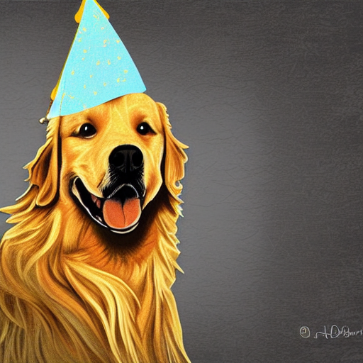
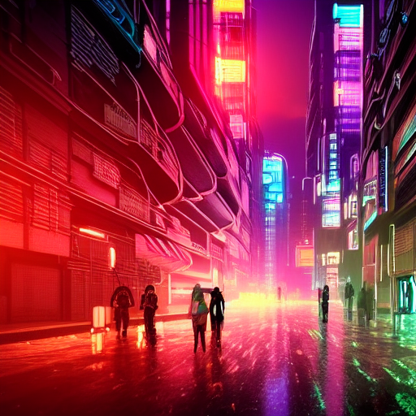

# 🎨 Neural Image Generation with Stable Diffusion

Task 02 of my Generative AI Internship @ Prodigy InfoTech (Track: GA) — using a pre-trained Stable Diffusion model to generate images from text prompts, built and understood from the ground up.

## Overview

Unlike training a model from scratch, this task focuses on correctly loading, configuring, and using a large pre-trained generative model — **Stable Diffusion v1.5** — entirely on CPU (no GPU/CUDA available). The goal wasn't just to run a script, but to understand every component of the pipeline: how text becomes an image through a repeated denoising process guided by a text encoder.

## Results

| Prompt | Output |
|---|---|
| *"a golden retriever wearing a wizard hat, digital art"* |  |
| *"a futuristic cyberpunk city street at night, neon lights, rain, cinematic"* |  |

Both generated at 512×512 resolution, 25 inference steps, on a CPU-only machine (Intel Iris Xe).

## How It Works

Stable Diffusion is a **latent diffusion model** made up of several sub-models working together:

1. **Text Encoder (CLIP)** — converts the text prompt into a numerical embedding that captures its meaning
2. **VAE (Variational Autoencoder)** — compresses images into a smaller "latent space" representation (and later decodes back into a full image); this is what makes the diffusion process computationally feasible
3. **U-Net** — the core denoising network; starting from pure random noise in latent space, it repeatedly predicts and removes noise, guided at every step by the text embedding
4. **Scheduler** — controls exactly how noise is added/removed at each step; this project uses `DPMSolverMultistepScheduler`, which reaches good quality in ~25 steps instead of the default ~50, roughly halving CPU compute time

The full flow: **text → CLIP embedding → random noise in latent space → 25 rounds of guided denoising → VAE decodes latent to pixels → final image**

## Tech Stack

- Python
- PyTorch (CPU build)
- Hugging Face `diffusers` (StableDiffusionPipeline)
- Hugging Face `transformers` (CLIP text encoder)
- Pillow

## Project Structure
Project-02-Image-Generation/
├── generate.py # main script — loads pipeline, generates image
├── output_dog.png # sample output 1
├── output_cyberpunk.png # sample output 2
├── requirements.txt # exact dependency versions
├── .gitignore
└── README.md


## How to Run

```bash
python -m venv venv
.\venv\Scripts\Activate.ps1        # Windows
pip install -r requirements.txt
python generate.py
```

Edit the `prompt` variable inside `generate.py` to generate your own images. Note: first run will download the ~4GB model from Hugging Face; subsequent runs load from local cache.

## What I Learned

- **Pre-trained doesn't mean plug-and-play.** Using `height=256, width=256` to save compute time completely broke the output — Stable Diffusion v1.5 was trained specifically on 512×512 images, and its U-Net architecture doesn't generalize well below that resolution. Every pre-trained model has an implicit "comfort zone" it was trained for, and stepping outside it can silently degrade quality rather than throw an error.
- **CPU inference cost scales predictably with resolution.** Doubling both width and height (256→512) resulted in almost exactly 4x slower generation per step (~2.1s/it → ~8.3s/it) — a direct, hands-on confirmation of how compute scales with pixel count.
- **Environment corruption is a real, recoverable thing.** An interrupted `pip install` left `torch` in a broken state (missing `RECORD` file, internal `ModuleNotFoundError`s on import) that wasn't obvious until actually trying to import it. The fix was a clean venv rebuild rather than trying to patch a broken install.
- **Hugging Face's local cache isn't always straightforward to force offline.** `HF_HUB_OFFLINE` and `local_files_only` both failed in different ways due to unrelated legacy checkpoint files (`.ckpt`) bundled in the same repo as the `diffusers`-format files actually needed. The most reliable fix was pointing `from_pretrained()` directly at the local snapshot folder path, bypassing the Hub's repo-ID lookup and completeness-checking logic entirely.
- **Stable Diffusion sometimes hallucinates fake "signatures"** in corners of outputs styled as "digital art" — a learned artifact from training on artwork that commonly included artist signatures/watermarks, not an actual reproduction of any real artist's mark.

## Acknowledgements

Built using the pre-trained `runwayml/stable-diffusion-v1-5` checkpoint via Hugging Face's `diffusers` library.